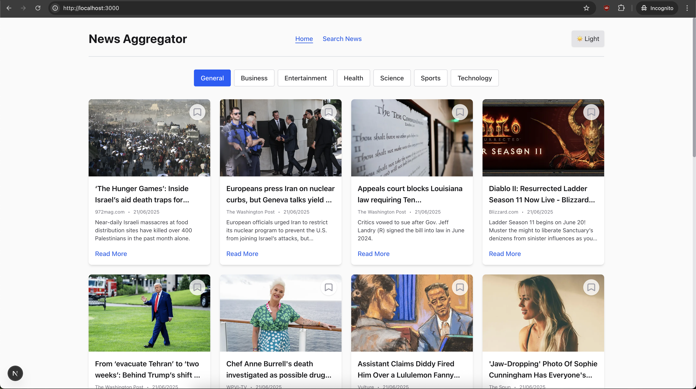
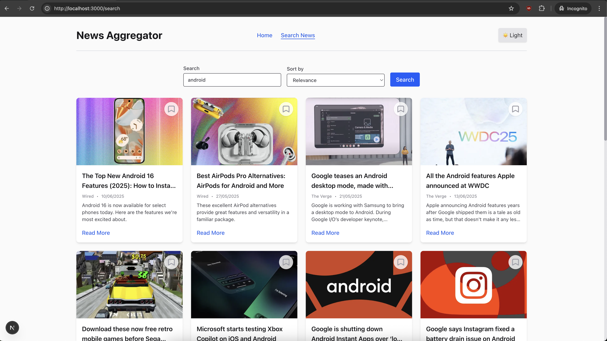
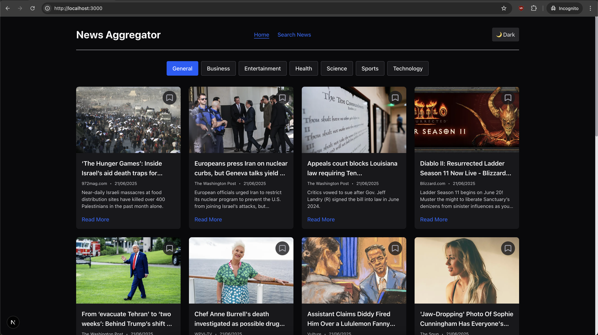
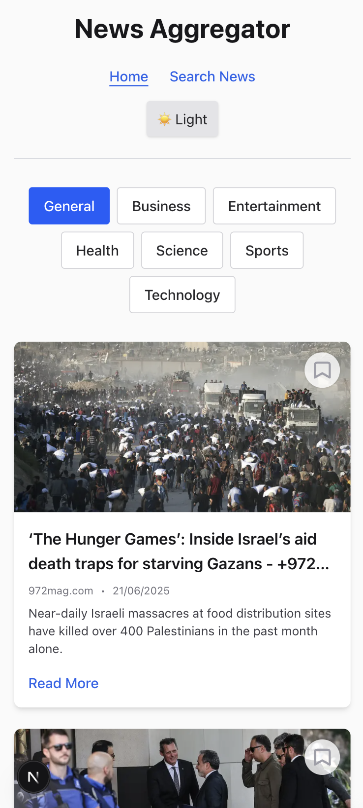
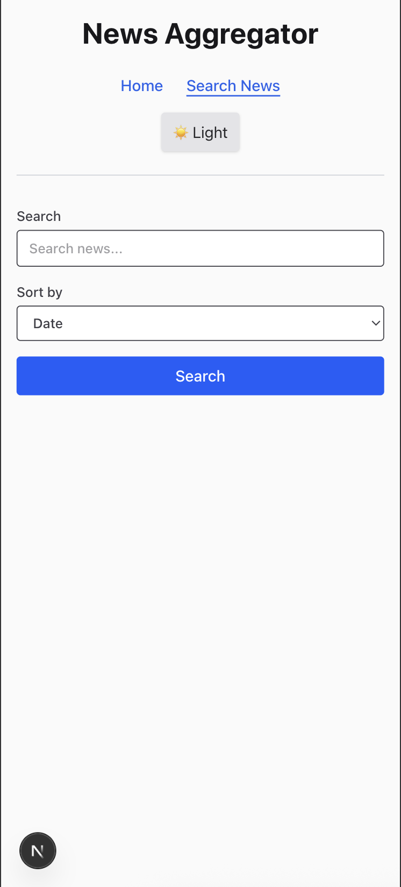

This is a [Next.js](https://nextjs.org) project bootstrapped with [`create-next-app`](https://github.com/vercel/next.js/tree/canary/packages/create-next-app).

## Getting Started

First, run the development server:

```bash
npm run dev
```

Open [http://localhost:3000](http://localhost:3000) with your browser to see the result.

## Design Decisions & Optimizations

**Component Structure:**

- The app uses a modular component structure for maintainability and reusability. The header (`AppHeader`) is a shared, responsive component used across all pages. Article display logic is encapsulated in `ArticleCard` and `ArticleGrid` for clarity and separation of concerns.

**Dark Mode:**

- Dark mode is implemented using Tailwind's `dark:` classes and a toggle button. The user's preference is stored in `localStorage` and respected on reload. The toggle updates both React state and the DOM for instant feedback.

**Error Handling:**

- All user-facing components (especially `ArticleCard`) include robust error handling for missing or malformed data, such as fallback UI for missing images, titles, or descriptions. API errors are surfaced to the user with clear messages.

**Bookmark Feature:**

- Bookmarks are managed in `localStorage` for persistence and instant UI feedback. The bookmark button updates state and storage atomically, and the icon reflects the current state. This avoids unnecessary re-renders and keeps the UI responsive.

**Testing:**

- Jest and React Testing Library are used for unit and integration tests. A test-only Babel config ensures fast Next.js builds (using SWC) while supporting JSX/ESM in tests. Tests mock browser APIs (like `localStorage` and `matchMedia`) for reliability.

**Performance:**

- Images use Next.js's `Image` component for optimized loading. The `priority` prop is only set when needed to avoid React warnings. Components are designed to minimize unnecessary renders and use React state efficiently.

**Responsiveness:**

- All UI elements are styled with Tailwind CSS for mobile-first responsiveness. The header, search form, and article grid adapt to different screen sizes for a seamless experience on all devices.

**Security:**

- API keys are stored in environment variables and only exposed to the client when necessary (using the `NEXT_PUBLIC_` prefix). Sensitive logic is kept server-side where possible.

**Developer Experience:**

- The codebase is linted with ESLint and formatted for readability. The project structure is simple and easy to navigate, with clear separation between UI, logic, and configuration.

## Assumptions

- It is assumed that the API keys provided for news data access do not have strict rate limiting.

## Screenshots

_Home page_


_Search page_


_Home page dark mode_


_Home page on mobile_


_Search page on mobile_


## Performance Optimizations

- **Next.js Image Optimization:** Uses the `Image` component for automatic image resizing, lazy loading, and format selection.
- **Conditional Priority Prop:** Only sets the `priority` prop on images when needed to avoid unnecessary eager loading and React warnings.
- **LocalStorage Bookmarks:** Bookmarks are managed client-side for instant feedback and no server round-trips.
- **Tailwind CSS:** Utility-first CSS ensures minimal, optimized styles and fast rendering.
- **Responsive Design:** Mobile-first layout and adaptive components reduce layout shifts and improve perceived performance.
- **Error Boundaries:** Fallback UI for missing data prevents render-blocking errors and keeps the app usable.
- **Minimal Re-renders:** State and effect hooks are scoped to minimize unnecessary component updates.
